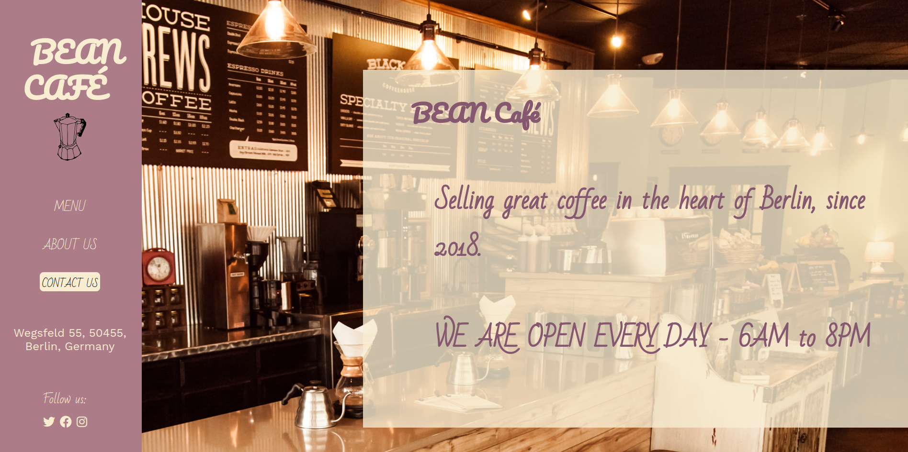
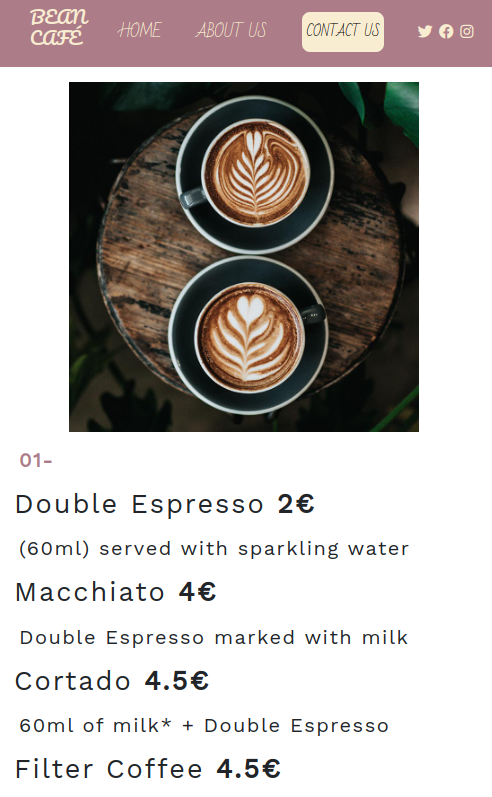

# Bean Café

## Table of Contents

- [Introduction](#introduction)
- [Bean Café Developers](#beancafe-developers)
- [Features](#features)
- [Requirements](#requirements)
- [Usage](#usage)
- [Technologies Used](#technologies-used)
- [Design](#design)
- [Project Structure](#project-structure)
- [Screenshot](#screenshot)

## Introduction
Our concept: A website for a local café shop (BEAN Café), with four pages: Home, Menu, About Us, Contact Us. Fully designed by us.

## Bean Café Developer
- [Elena Armaroli](https://github.com/elenarmaroli): worked on the Home page and side bar menu.
- [Netta Barel](https://github.com/Netta8): worked on the Menu page.
- [Buddhika Dehigolla](https://github.com/kurunegalA0): worked on the About Us page.
- [Adjei Solomon](https://github.com/HubSolomon): worked on the Contact Us page.

## Features
- Responsive design on any device
- Display of information relative to the business: contact information, opening times, about this business
- Display of full menu inclusive of pictures
- Contact form
- Embedded map to show location of the business

## Requirements
- npm install
- sass
- bootstrap

## Usage
- To run client side: npm start
- Access the application at `http://localhost:1234/`

## Technologies Used
- HTML
- CSS/SaSS
- Bootstrap
- npm 

## Design
The website was fully designed by us. 
This included choosing a color palette, fonts, and font sizes.
Our color palette: #F8ECD1 rgb(248, 236, 209) -> for the home right section, buttons #DEB6AB rgb(222, 182, 171) #AC7D88 rgb(172, 125, 136) -> for the nav bar #85586F rgb(133, 88, 111)
Our fonts: font-family: 'Bad Script', cursive; -> for h1 font-family: 'Pacifico', cursive; -> for smaller headings font-family: 'Work Sans', sans-serif; -> for p text

## Project Structure
- `src/`: Contains the frontend code.

## Screenshot
Here, you can see the sleek and user-friendly interface. The side-bar menu moves to the top on a mobile device, providing a smooth and enjoyable user experience.

